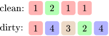

Bob is about to go on a trip. But first he needs to take care of his supply of socks. Each sock has its own color. Bob wants to take as many pairs of clean socks as possible (both socks in the pair should be of the same color).

Socks are divided into two drawers: clean and dirty socks. Bob has time for only one laundry and his washing machine can clean at most K socks. He wants to pick socks for laundering in such a way that after washing he will have a maximal number of clean, same-colored pairs of socks. It is possible that some socks cannot be paired with any other sock, because Bob may have lost some socks over the years.

Bob has exactly N clean and M dirty socks, which are described in arrays C and D, respectively. The colors of the socks are represented as integers (equal numbers representing identical colors).

For example, given four clean socks and five dirty socks:

If Bob's washing machine can clean at most K = 2 socks, then he can take a maximum of three pairs of clean socks. He can wash one red sock and one green sock, numbered 1 and 2 respectively. Then he will have two pairs of red socks and one pair of green socks.

Write a function:

int solution(int K, vector<int> &C, vector<int> &D);

that, given an integer K (the number of socks that the washing machine can clean), two arrays C and D (containing the color representations of N clean and M dirty socks respectively), returns the maximum number of pairs of socks that Bob can take on the trip.

For example, given K = 2, C = [1, 2, 1, 1] and D = [1, 4, 3, 2, 4], the function should return 3, as explained above.

Assume that:

K is an integer within the range [0..50];
each element of arrays C, D is an integer within the range [1..50];
C and D are not empty and each of them contains at most 50 elements.
In your solution, focus on correctness. The performance of your solution will not be the focus of the assessment.