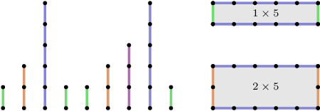

Halfling Woolly Proudhoof is an eminent sheep herder. He wants to build a pen (enclosure) for his new flock of sheep. The pen will be rectangular and built from exactly four pieces of fence (so, the pieces of fence forming the opposite sides of the pen must be of equal length). Woolly can choose these pieces out of N pieces of fence that are stored in his barn. To hold the entire flock, the area of the pen must be greater than or equal to a given threshold X.

Woolly is interested in the number of different ways in which he can build a pen. Pens are considered different if the sets of lengths of their sides are different. For example, a pen of size 1×4 is different from a pen of size 2×2 (although both have an area of 4), but pens of sizes 1×2 and 2×1 are considered the same.

Write a function:

`int solution(vector<int> &A, int X);`

that, given an array A of N integers (containing the lengths of the available pieces of fence) and an integer X, returns the number of different ways of building a rectangular pen satisfying the above conditions. The function should return −1 if the result exceeds 1,000,000,000.

For example, given X = 5 and the following array A:

  - A[0] = 1
  - A[1] = 2
  - A[2] = 5
  - A[3] = 1
  - A[4] = 1
  - A[5] = 2
  - A[6] = 3
  - A[7] = 5
  - A[8] = 1

the function should return 2. The figure above shows available pieces of fence (on the left) and possible to build pens (on the right). The pens are of sizes 1x5 and 2x5. Pens of sizes 1×1 and 1×2 can be built, but are too small in area. It is not possible to build pens of sizes 2×3 or 3×5, as there is only one piece of fence of length 3.

Write an efficient algorithm for the following assumptions:

N is an integer within the range [0..100,000];
X is an integer within the range [1..1,000,000,000];
each element of array A is an integer within the range [1..1,000,000,000].